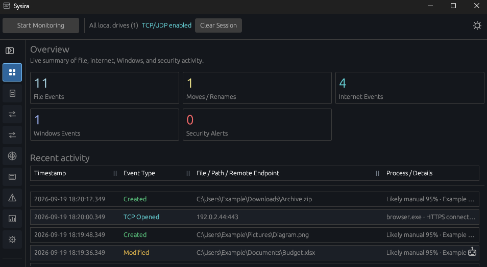
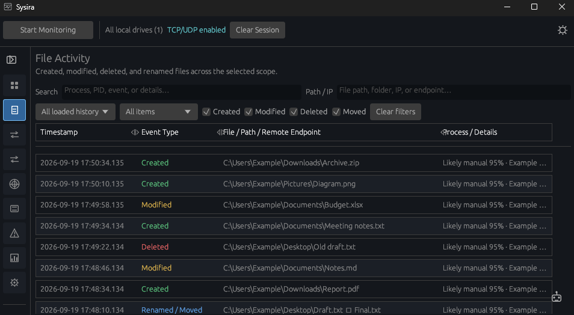
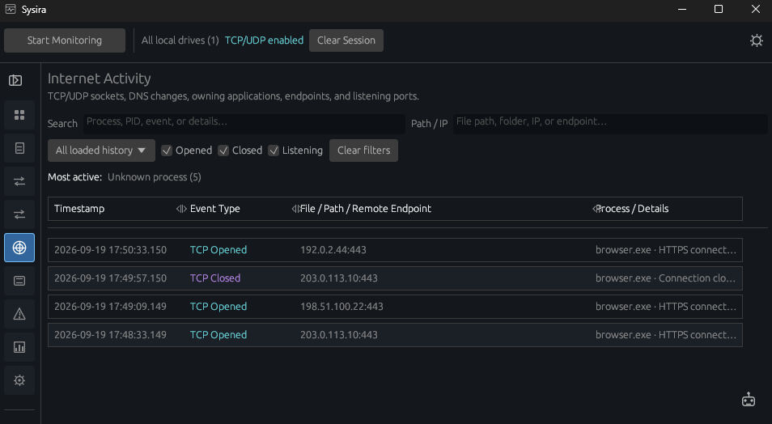
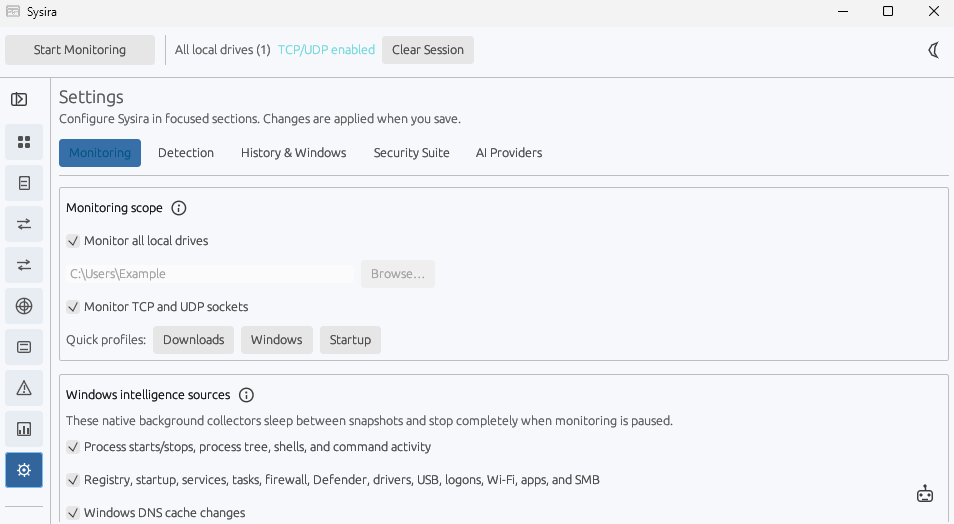

<h1 align="center">Sysira</h1>

A Windows desktop app for reviewing file changes, moves, network connections, Windows activity, and security alerts in one place.

  
  
  
  

  
  
  
  

Setup is recommended for a normal installation. Portable runs without installing. MSI is for managed deployment. All three contain the same Sysira application.

## Screenshots

These tightly captured app screenshots use demonstration data, not a user's desktop, activity, or accounts.

| Overview | File activity |
| --- | --- |
|  |  |

| Internet activity | Light mode settings |
| --- | --- |
|  |  |

## Downloads and updates

Sysira checks this repository's latest release in the background. The download icon beside the light/dark mode control appears **only when a newer version is available**. Choose Setup, Portable, or MSI, then download and verify it inside Sysira or open the release page. After a verified Setup or MSI download, use **Install update** inside Sysira to launch the standard Windows installer. Sysira closes after Windows starts it; updates are never installed silently. Portable is a standalone download, not an installer.

This repository publishes downloads and product screenshots only; the Rust application source code is not published here. GitHub may offer automatic “Source code” archives of this documentation repository, which do **not** contain the application source.
